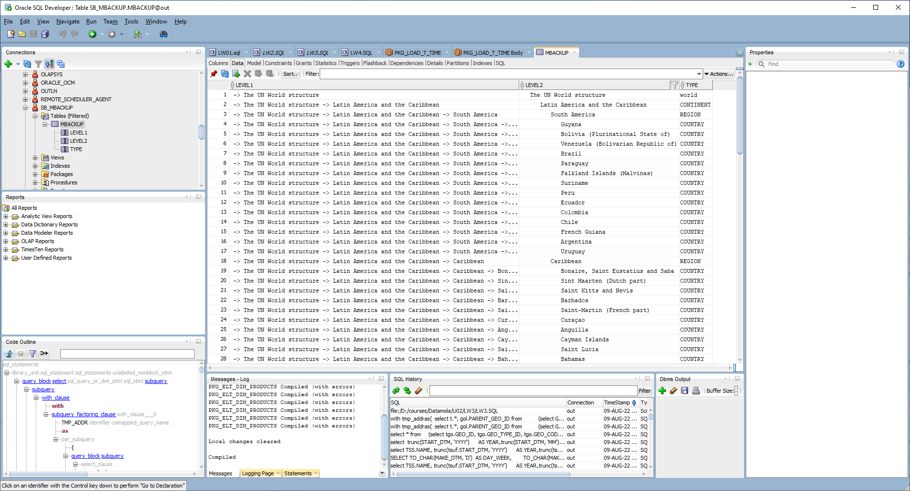

# Task 1

```sql

create TABLESPACE TS_MBackUp_ts_01
DATAFILE '/oracle/u02/oradata/AShumilovdb/db_qpt_MBackUp_data_01.dat'
size 150M
autoextend on next 50M
segment space management auto;


create user SB_MBackUp IDENTIFIED BY "%PWD%"
    DEFAULT TABLESPACE TS_MBackUp_ts_01;

GRANT CONNECT,RESOURCE TO SB_MBackUp;

ALTER USER SB_MBackUp  quota unlimited on TS_MBackUp_ts_01;


create table SB_MBackUp.MBackUp
as 
with tmp_addr
as
(  select t.*, gol.PARENT_GEO_ID from       
    (select GEO_ID,GEO_SYSTEM_ID PART_ID,  GEO_SYSTEM_CODE CODE, GEO_SYSTEM_DESC PART_DESC, LOCALIZATION_ID
    FROM 
    U_DW_REFERENCES.LC_GEO_SYSTEMS
    UNION ALL
    select GEO_ID, PART_ID,  PART_CODE CODE, PART_DESC , LOCALIZATION_ID
    FROM 
    U_DW_REFERENCES.LC_GEO_PARTS
    UNION ALL
    select GEO_ID, REGION_ID PART_ID,  REGION_CODE CODE,REGION_DESC PART_DESC , LOCALIZATION_ID
    FROM 
    U_DW_REFERENCES.LC_GEO_REGIONS
    UNION ALL
    select GEO_ID, COUNTRY_ID PART_ID,  COUNTRY_CODE_A3 CODE,COUNTRY_DESC PART_DESC , LOCALIZATION_ID
    FROM 
    U_DW_REFERENCES.LC_COUNTRIES) t
    left join 
    U_DW_REFERENCES.T_GEO_OBJECT_LINKS gol
    on 
    t.GEO_ID = gol.CHILD_GEO_ID
)
select sys_connect_by_path(PART_DESC, ' -> ') LEVEL1,
        lpad(' ', level*3, ' ')|| PART_DESC LEVEL2, 
        decode(level ,
            1, 'world',
            2, 'CONTINENT',
            3, 'REGION',
            'COUNTRY') TYPE
        from tmp_addr
connect by prior GEO_ID=PARENT_GEO_ID
start with PARENT_GEO_ID is null
;
```

```sql
-
--LEVEL1                                                                                                              |LEVEL2                                                          |TYPE     |
----------------------------------------------------------------------------------------------------------------------+----------------------------------------------------------------+---------+
-- -> The UN World structure                                                                                          |   The UN World structure                                       |world    |
-- -> The UN World structure -> Latin America and the Caribbean                                                       |      Latin America and the Caribbean                           |CONTINENT|
-- -> The UN World structure -> Latin America and the Caribbean -> South America                                      |         South America                                          |REGION   |
-- -> The UN World structure -> Latin America and the Caribbean -> South America -> Guyana                            |            Guyana                                              |COUNTRY  |
-- -> The UN World structure -> Latin America and the Caribbean -> South America -> Bolivia (Plurinational State of)  |            Bolivia (Plurinational State of)                    |COUNTRY  |
-- -> The UN World structure -> Latin America and the Caribbean -> South America -> Venezuela (Bolivarian Republic of)|            Venezuela (Bolivarian Republic of)                  |COUNTRY  |
-- -> The UN World structure -> Latin America and the Caribbean -> South America -> Brazil                            |            Brazil                                              |COUNTRY  |
-- -> The UN World structure -> Latin America and the Caribbean -> South America -> Paraguay                          |            Paraguay                                            |COUNTRY  |
-- -> The UN World structure -> Latin America and the Caribbean -> South America -> Falkland Islands (Malvinas)       |            Falkland Islands (Malvinas)                         |COUNTRY  |
-- -> The UN World structure -> Latin America and the Caribbean -> South America -> Suriname                          |            Suriname                                            |COUNTRY  |
-- -> The UN World structure -> Latin America and the Caribbean -> South America -> Peru                              |            Peru                                                |COUNTRY  |
-- -> The UN World structure -> Latin America and the Caribbean -> South America -> Ecuador                           |            Ecuador                                             |COUNTRY  |
-- -> The UN World structure -> Latin America and the Caribbean -> South America -> Colombia                          |            Colombia                                            |COUNTRY  |
-- -> The UN World structure -> Latin America and the Caribbean -> South America -> Chile                             |            Chile                                               |COUNTRY  |
-- -> The UN World structure -> Latin America and the Caribbean -> South America -> French Guiana                     |            French Guiana                                       |COUNTRY  |
-- -> The UN World structure -> Latin America and the Caribbean -> South America -> Argentina                         |            Argentina                                           |COUNTRY  |
-- -> The UN World structure -> Latin America and the Caribbean -> South America -> Uruguay                           |            Uruguay                                             |COUNTRY  |
-- -> The UN World structure -> Latin America and the Caribbean -> Caribbean                                          |         Caribbean                                              |REGION   |
-- -> The UN World structure -> Latin America and the Caribbean -> Caribbean -> Bonaire, Saint Eustatius and Saba     |            Bonaire, Saint Eustatius and Saba                   |COUNTRY  |
-- -> The UN World structure -> Latin America and the Caribbean -> Caribbean -> Sint Maarten (Dutch part)             |            Sint Maarten (Dutch part)                           |COUNTRY  |
-- -> The UN World structure -> Latin America and the Caribbean -> Caribbean -> Saint Kitts and Nevis                 |            Saint Kitts and Nevis                               |COUNTRY  |
-- -> The UN World structure -> Latin America and the Caribbean -> Caribbean -> Barbados                              |            Barbados                                            |COUNTRY  |
-- -> The UN World structure -> Latin America and the Caribbean -> Caribbean -> Saint-Martin (French part)            |            Saint-Martin (French part)                          |COUNTRY  |
-- -> The UN World structure -> Latin America and the Caribbean -> Caribbean -> Curaçao                               |            Curaçao                                             |COUNTRY  |
-- -> The UN World structure -> Latin America and the Caribbean -> Caribbean -> Anguilla                              |            Anguilla                                            |COUNTRY  |
-- -> The UN World structure -> Latin America and the Caribbean -> Caribbean -> Cayman Islands                        |            Cayman Islands                                      |COUNTRY  |
-- -> The UN World structure -> Latin America and the Caribbean -> Caribbean -> Saint Lucia                           |            Saint Lucia                                         |COUNTRY  |
-- -> The UN World structure -> Latin America and the Caribbean -> Caribbean -> Bahamas                               |            Bahamas                                             |COUNTRY  |
-- -> The UN World structure -> Latin America and the Caribbean -> Caribbean -> Saint-Barthélemy                      |            Saint-Barthélemy                                    |COUNTRY  |
-- -> The UN World structure -> Latin America and the Caribbean -> Caribbean -> Dominica                              |            Dominica                                            |COUNTRY  |
-- -> The UN World structure -> Latin America and the Caribbean -> Caribbean -> Turks and Caicos Islands              |            Turks and Caicos Islands                            |COUNTRY  |
-- -> The UN World structure -> Latin America and the Caribbean -> Caribbean -> Dominican Republic                    |            Dominican Republic                                  |COUNTRY  |
-- -> The UN World structure -> Latin America and the Caribbean -> Caribbean -> Puerto Rico                           |            Puerto Rico                                         |COUNTRY  |
-- -> The UN World structure -> Latin America and the Caribbean -> Caribbean -> Antigua and Barbuda                   |            Antigua and Barbuda                                 |COUNTRY  |
-- -> The UN World structure -> Latin America and the Caribbean -> Caribbean -> Guadeloupe                            |            Guadeloupe                                          |COUNTRY  |
-- -> The UN World structure -> Latin America and the Caribbean -> Caribbean -> Aruba                                 |            Aruba                                               |COUNTRY  |
-- -> The UN World structure -> Latin America and the Caribbean -> Caribbean -> Saint Vincent and the Grenadines      |            Saint Vincent and the Grenadines                    |COUNTRY  |
-- -> The UN World structure -> Latin America and the Caribbean -> Caribbean -> Jamaica                               |            Jamaica                                             |COUNTRY  |
-- -> The UN World structure -> Latin America and the Caribbean -> Caribbean -> United States Virgin Islands          |            United States Virgin Islands                        |COUNTRY  |
-- -> The UN World structure -> Latin America and the Caribbean -> Caribbean -> Montserrat                            |            Montserrat                                          |COUNTRY  |
-- -> The UN World structure -> Latin America and the Caribbean -> Caribbean -> Cuba                                  |            Cuba                                                |COUNTRY  |
-- -> The UN World structure -> Latin America and the Caribbean -> Caribbean -> British Virgin Islands                |            British Virgin Islands                              |COUNTRY  |
-- -> The UN World structure -> Latin America and the Caribbean -> Caribbean -> Haiti                                 |            Haiti                                               |COUNTRY  |
-- -> The UN World structure -> Latin America and the Caribbean -> Caribbean -> Trinidad and Tobago                   |            Trinidad and Tobago                                 |COUNTRY  |
-- -> The UN World structure -> Latin America and the Caribbean -> Caribbean -> Martinique                            |            Martinique                                          |COUNTRY  |
-- -> The UN World structure -> Latin America and the Caribbean -> Caribbean -> Grenada                               |            Grenada                                             |COUNTRY  |
-- -> The UN World structure -> Latin America and the Caribbean -> Central America                                    |         Central America                                        |REGION   |
-- -> The UN World structure -> Latin America and the Caribbean -> Central America -> Panama                          |            Panama                                              |COUNTRY  |
-- -> The UN World structure -> Latin America and the Caribbean -> Central America -> Guatemala                       |            Guatemala                                           |COUNTRY  |
-- -> The UN World structure -> Latin America and the Caribbean -> Central America -> Nicaragua                       |            Nicaragua                                           |COUNTRY  |
-- -> The UN World structure -> Latin America and the Caribbean -> Central America -> Belize                          |            Belize                                              |COUNTRY  |
-- -> The UN World structure -> Latin America and the Caribbean -> Central America -> Costa Rica                      |            Costa Rica                                          |COUNTRY  |
-- -> The UN World structure -> Latin America and the Caribbean -> Central America -> El Salvador                     |            El Salvador                                         |COUNTRY  |
-- -> The UN World structure -> Latin America and the Caribbean -> Central America -> Honduras                        |            Honduras                                            |COUNTRY  |
-- -> The UN World structure -> Latin America and the Caribbean -> Central America -> Mexico                          |            Mexico                                              |COUNTRY  |
-- -> The UN World structure -> Africa                                                                                |      Africa                                                    |CONTINENT|
-- -> The UN World structure -> Africa -> Eastern Africa                                                              |         Eastern Africa                                         |REGION   |
-- -> The UN World structure -> Africa -> Eastern Africa -> Somalia                                                   |            Somalia                                             |COUNTRY  |
-- -> The UN World structure -> Africa -> Eastern Africa -> Eritrea                                                   |            Eritrea                                             |COUNTRY  |
-- -> The UN World structure -> Africa -> Eastern Africa -> Burundi                                                   |            Burundi                                             |COUNTRY  |
-- -> The UN World structure -> Africa -> Eastern Africa -> Seychelles                                                |            Seychelles                                          |COUNTRY  |
-- -> The UN World structure -> Africa -> Eastern Africa -> Kenya                                                     |            Kenya                                               |COUNTRY  |
-- -> The UN World structure -> Africa -> Eastern Africa -> Djibouti                                                  |            Djibouti                                            |COUNTRY  |
-- -> The UN World structure -> Africa -> Eastern Africa -> Réunion                                                   |            Réunion                                             |COUNTRY  |
-- -> The UN World structure -> Africa -> Eastern Africa -> Madagascar                                                |            Madagascar                                          |COUNTRY  |
-- -> The UN World structure -> Africa -> Eastern Africa -> Rwanda                                                    |            Rwanda                                              |COUNTRY  |
-- -> The UN World structure -> Africa -> Eastern Africa -> Malawi                                                    |            Malawi                                              |COUNTRY  |
-- -> The UN World structure -> Africa -> Eastern Africa -> Ethiopia                                                  |            Ethiopia                                            |COUNTRY  |
-- -> The UN World structure -> Africa -> Eastern Africa -> Mauritius                                                 |            Mauritius                                           |COUNTRY  |
-- -> The UN World structure -> Africa -> Eastern Africa -> Zambia                                                    |            Zambia                                              |COUNTRY  |
-- -> The UN World structure -> Africa -> Eastern Africa -> Comoros                                                   |            Comoros                                             |COUNTRY  |
-- -> The UN World structure -> Africa -> Eastern Africa -> Zimbabwe                                                  |            Zimbabwe                                            |COUNTRY  |
-- -> The UN World structure -> Africa -> Eastern Africa -> United Republic of Tanzania                               |            United Republic of Tanzania                         |COUNTRY  |
-- -> The UN World structure -> Africa -> Eastern Africa -> Uganda                                                    |            Uganda                                              |COUNTRY  |
-- -> The UN World structure -> Africa -> Eastern Africa -> Mayotte                                                   |            Mayotte                                             |COUNTRY  |
-- -> The UN World structure -> Africa -> Eastern Africa -> Mozambique                                                |            Mozambique                                          |COUNTRY  |
-- -> The UN World structure -> Africa -> Northern Africa                                                             |         Northern Africa                                        |REGION   |
-- -> The UN World structure -> Africa -> Northern Africa -> Morocco                                                  |            Morocco                                             |COUNTRY  |
-- -> The UN World structure -> Africa -> Northern Africa -> Western Sahara                                           |            Western Sahara                                      |COUNTRY  |
-- -> The UN World structure -> Africa -> Northern Africa -> Libya                                                    |            Libya                                               |COUNTRY  |
-- -> The UN World structure -> Africa -> Northern Africa -> Algeria                                                  |            Algeria                                             |COUNTRY  |
-- -> The UN World structure -> Africa -> Northern Africa -> Tunisia                                                  |            Tunisia                                             |COUNTRY  |
-- -> The UN World structure -> Africa -> Northern Africa -> Egypt                                                    |            Egypt                                               |COUNTRY  |
-- -> The UN World structure -> Africa -> Northern Africa -> Sudan                                                    |            Sudan                                               |COUNTRY  |
-- -> The UN World structure -> Africa -> Northern Africa -> South Sudan                                              |            South Sudan                                         |COUNTRY  |
-- -> The UN World structure -> Africa -> Western Africa                                                              |         Western Africa                                         |REGION   |
-- -> The UN World structure -> Africa -> Western Africa -> Gambia                                                    |            Gambia                                              |COUNTRY  |
-- -> The UN World structure -> Africa -> Western Africa -> Mauritania                                                |            Mauritania                                          |COUNTRY  |
-- -> The UN World structure -> Africa -> Western Africa -> Togo                                                      |            Togo                                                |COUNTRY  |
-- -> The UN World structure -> Africa -> Western Africa -> Liberia                                                   |            Liberia                                             |COUNTRY  |
-- -> The UN World structure -> Africa -> Western Africa -> Saint Helena                                              |            Saint Helena                                        |COUNTRY  |
-- -> The UN World structure -> Africa -> Western Africa -> Benin                                                     |            Benin                                               |COUNTRY  |
-- -> The UN World structure -> Africa -> Western Africa -> Mali                                                      |            Mali                                                |COUNTRY  |
-- -> The UN World structure -> Africa -> Western Africa -> Ghana                                                     |            Ghana                                               |COUNTRY  |
-- -> The UN World structure -> Africa -> Western Africa -> Guinea                                                    |            Guinea                                              |COUNTRY  |
-- -> The UN World structure -> Africa -> Western Africa -> Côte d'Ivoire                                             |            Côte d'Ivoire                                       |COUNTRY  |
-- -> The UN World structure -> Africa -> Western Africa -> Burkina Faso                                              |            Burkina Faso                                        |COUNTRY  |
-- -> The UN World structure -> Africa -> Western Africa -> Sierra Leone                                              |            Sierra Leone                                        |COUNTRY  |
-- -> The UN World structure -> Africa -> Western Africa -> Senegal                                                   |            Senegal                                             |COUNTRY  |
-- -> The UN World structure -> Africa -> Western Africa -> Nigeria                                                   |            Nigeria                                             |COUNTRY  |
-- -> The UN World structure -> Africa -> Western Africa -> Cape Verde                                                |            Cape Verde                                          |COUNTRY  |
-- -> The UN World structure -> Africa -> Western Africa -> Guinea-Bissau                                             |            Guinea-Bissau                                       |COUNTRY  |
-- -> The UN World structure -> Africa -> Western Africa -> Niger                                                     |            Niger                                               |COUNTRY  |
-- -> The UN World structure -> Africa -> Middle Africa                                                               |         Middle Africa                                          |REGION   |
-- -> The UN World structure -> Africa -> Middle Africa -> Equatorial Guinea                                          |            Equatorial Guinea                                   |COUNTRY  |
-- -> The UN World structure -> Africa -> Middle Africa -> Democratic Republic of the Congo                           |            Democratic Republic of the Congo                    |COUNTRY  |
-- -> The UN World structure -> Africa -> Middle Africa -> Gabon                                                      |            Gabon                                               |COUNTRY  |
-- -> The UN World structure -> Africa -> Middle Africa -> Central African Republic                                   |            Central African Republic                            |COUNTRY  |
-- -> The UN World structure -> Africa -> Middle Africa -> Sao Tome and Principe                                      |            Sao Tome and Principe                               |COUNTRY  |
-- -> The UN World structure -> Africa -> Middle Africa -> Congo                                                      |            Congo                                               |COUNTRY  |
-- -> The UN World structure -> Africa -> Middle Africa -> Cameroon                                                   |            Cameroon                                            |COUNTRY  |
-- -> The UN World structure -> Africa -> Middle Africa -> Chad                                                       |            Chad                                                |COUNTRY  |
-- -> The UN World structure -> Africa -> Middle Africa -> Angola                                                     |            Angola                                              |COUNTRY  |
-- -> The UN World structure -> Africa -> Southern Africa                                                             |         Southern Africa                                        |REGION   |
-- -> The UN World structure -> Africa -> Southern Africa -> Botswana                                                 |            Botswana                                            |COUNTRY  |
-- -> The UN World structure -> Africa -> Southern Africa -> Swaziland                                                |            Swaziland                                           |COUNTRY  |
-- -> The UN World structure -> Africa -> Southern Africa -> Namibia                                                  |            Namibia                                             |COUNTRY  |
-- -> The UN World structure -> Africa -> Southern Africa -> Lesotho                                                  |            Lesotho                                             |COUNTRY  |
-- -> The UN World structure -> Africa -> Southern Africa -> South Africa                                             |            South Africa                                        |COUNTRY  |
-- -> The UN World structure -> Northern America                                                                      |      Northern America                                          |CONTINENT|
-- -> The UN World structure -> Northern America -> Northern America                                                  |         Northern America                                       |REGION   |
-- -> The UN World structure -> Northern America -> Northern America -> Canada                                        |            Canada                                              |COUNTRY  |
-- -> The UN World structure -> Northern America -> Northern America -> United States of America                      |            United States of America                            |COUNTRY  |
-- -> The UN World structure -> Northern America -> Northern America -> Saint Pierre and Miquelon                     |            Saint Pierre and Miquelon                           |COUNTRY  |
-- -> The UN World structure -> Northern America -> Northern America -> Bermuda                                       |            Bermuda                                             |COUNTRY  |
-- -> The UN World structure -> Northern America -> Northern America -> Greenland                                     |            Greenland                                           |COUNTRY  |
-- -> The UN World structure -> Asia                                                                                  |      Asia                                                      |CONTINENT|
-- -> The UN World structure -> Asia -> Central Asia                                                                  |         Central Asia                                           |REGION   |
-- -> The UN World structure -> Asia -> Central Asia -> Tajikistan                                                    |            Tajikistan                                          |COUNTRY  |
-- -> The UN World structure -> Asia -> Central Asia -> Turkmenistan                                                  |            Turkmenistan                                        |COUNTRY  |
-- -> The UN World structure -> Asia -> Central Asia -> Uzbekistan                                                    |            Uzbekistan                                          |COUNTRY  |
-- -> The UN World structure -> Asia -> Central Asia -> Kyrgyzstan                                                    |            Kyrgyzstan                                          |COUNTRY  |
-- -> The UN World structure -> Asia -> Central Asia -> Kazakhstan                                                    |            Kazakhstan                                          |COUNTRY  |
-- -> The UN World structure -> Asia -> Southern Asia                                                                 |         Southern Asia                                          |REGION   |
-- -> The UN World structure -> Asia -> Eastern Asia                                                                  |         Eastern Asia                                           |REGION   |
-- -> The UN World structure -> Asia -> Eastern Asia -> Republic of Korea                                             |            Republic of Korea                                   |COUNTRY  |
-- -> The UN World structure -> Asia -> Eastern Asia -> Mongolia                                                      |            Mongolia                                            |COUNTRY  |
-- -> The UN World structure -> Asia -> Eastern Asia -> Bhutan                                                        |            Bhutan                                              |COUNTRY  |
-- -> The UN World structure -> Asia -> Eastern Asia -> Bangladesh                                                    |            Bangladesh                                          |COUNTRY  |
-- -> The UN World structure -> Asia -> Eastern Asia -> China, Hong Kong Special Administrative Region                |            China, Hong Kong Special Administrative Region      |COUNTRY  |
-- -> The UN World structure -> Asia -> Eastern Asia -> Maldives                                                      |            Maldives                                            |COUNTRY  |
-- -> The UN World structure -> Asia -> Eastern Asia -> Pakistan                                                      |            Pakistan                                            |COUNTRY  |
-- -> The UN World structure -> Asia -> Eastern Asia -> India                                                         |            India                                               |COUNTRY  |
-- -> The UN World structure -> Asia -> Eastern Asia -> Democratic People's Republic of Korea                         |            Democratic People's Republic of Korea               |COUNTRY  |
-- -> The UN World structure -> Asia -> Eastern Asia -> China, Macao Special Administrative Region                    |            China, Macao Special Administrative Region          |COUNTRY  |
-- -> The UN World structure -> Asia -> Eastern Asia -> Iran (Islamic Republic of)                                    |            Iran (Islamic Republic of)                          |COUNTRY  |
-- -> The UN World structure -> Asia -> Eastern Asia -> China                                                         |            China                                               |COUNTRY  |
-- -> The UN World structure -> Asia -> Eastern Asia -> Afghanistan                                                   |            Afghanistan                                         |COUNTRY  |
-- -> The UN World structure -> Asia -> Eastern Asia -> Japan                                                         |            Japan                                               |COUNTRY  |
-- -> The UN World structure -> Asia -> Eastern Asia -> Nepal                                                         |            Nepal                                               |COUNTRY  |
-- -> The UN World structure -> Asia -> Eastern Asia -> Sri Lanka                                                     |            Sri Lanka                                           |COUNTRY  |
-- -> The UN World structure -> Asia -> Western Asia                                                                  |         Western Asia                                           |REGION   |
-- -> The UN World structure -> Asia -> Western Asia -> Oman                                                          |            Oman                                                |COUNTRY  |
-- -> The UN World structure -> Asia -> Western Asia -> Jordan                                                        |            Jordan                                              |COUNTRY  |
-- -> The UN World structure -> Asia -> Western Asia -> Kuwait                                                        |            Kuwait                                              |COUNTRY  |
-- -> The UN World structure -> Asia -> Western Asia -> Turkey                                                        |            Turkey                                              |COUNTRY  |
-- -> The UN World structure -> Asia -> Western Asia -> Armenia                                                       |            Armenia                                             |COUNTRY  |
-- -> The UN World structure -> Asia -> Western Asia -> Iraq                                                          |            Iraq                                                |COUNTRY  |
-- -> The UN World structure -> Asia -> Western Asia -> Azerbaijan                                                    |            Azerbaijan                                          |COUNTRY  |
-- -> The UN World structure -> Asia -> Western Asia -> Georgia                                                       |            Georgia                                             |COUNTRY  |
-- -> The UN World structure -> Asia -> Western Asia -> Occupied Palestinian Territory                                |            Occupied Palestinian Territory                      |COUNTRY  |
-- -> The UN World structure -> Asia -> Western Asia -> Cyprus                                                        |            Cyprus                                              |COUNTRY  |
-- -> The UN World structure -> Asia -> Western Asia -> United Arab Emirates                                          |            United Arab Emirates                                |COUNTRY  |
-- -> The UN World structure -> Asia -> Western Asia -> Qatar                                                         |            Qatar                                               |COUNTRY  |
-- -> The UN World structure -> Asia -> Western Asia -> Lebanon                                                       |            Lebanon                                             |COUNTRY  |
-- -> The UN World structure -> Asia -> Western Asia -> Bahrain                                                       |            Bahrain                                             |COUNTRY  |
-- -> The UN World structure -> Asia -> Western Asia -> Yemen                                                         |            Yemen                                               |COUNTRY  |
-- -> The UN World structure -> Asia -> Western Asia -> Israel                                                        |            Israel                                              |COUNTRY  |
-- -> The UN World structure -> Asia -> Western Asia -> Syrian Arab Republic                                          |            Syrian Arab Republic                                |COUNTRY  |
-- -> The UN World structure -> Asia -> Western Asia -> Saudi Arabia                                                  |            Saudi Arabia                                        |COUNTRY  |
-- -> The UN World structure -> Asia -> South-Eastern Asia                                                            |         South-Eastern Asia                                     |REGION   |
-- -> The UN World structure -> Asia -> South-Eastern Asia -> Lao People's Democratic Republic                        |            Lao People's Democratic Republic                    |COUNTRY  |
-- -> The UN World structure -> Asia -> South-Eastern Asia -> Singapore                                               |            Singapore                                           |COUNTRY  |
-- -> The UN World structure -> Asia -> South-Eastern Asia -> Indonesia                                               |            Indonesia                                           |COUNTRY  |
-- -> The UN World structure -> Asia -> South-Eastern Asia -> Myanmar                                                 |            Myanmar                                             |COUNTRY  |
-- -> The UN World structure -> Asia -> South-Eastern Asia -> Philippines                                             |            Philippines                                         |COUNTRY  |
-- -> The UN World structure -> Asia -> South-Eastern Asia -> Viet Nam                                                |            Viet Nam                                            |COUNTRY  |
-- -> The UN World structure -> Asia -> South-Eastern Asia -> Cambodia                                                |            Cambodia                                            |COUNTRY  |
-- -> The UN World structure -> Asia -> South-Eastern Asia -> Thailand                                                |            Thailand                                            |COUNTRY  |
-- -> The UN World structure -> Asia -> South-Eastern Asia -> Brunei Darussalam                                       |            Brunei Darussalam                                   |COUNTRY  |
-- -> The UN World structure -> Asia -> South-Eastern Asia -> Malaysia                                                |            Malaysia                                            |COUNTRY  |
-- -> The UN World structure -> Asia -> South-Eastern Asia -> Timor-Leste                                             |            Timor-Leste                                         |COUNTRY  |
-- -> The UN World structure -> Oceania                                                                               |      Oceania                                                   |CONTINENT|
-- -> The UN World structure -> Oceania -> Micronesia                                                                 |         Micronesia                                             |REGION   |
-- -> The UN World structure -> Oceania -> Micronesia -> Nauru                                                        |            Nauru                                               |COUNTRY  |
-- -> The UN World structure -> Oceania -> Micronesia -> Northern Mariana Islands                                     |            Northern Mariana Islands                            |COUNTRY  |
-- -> The UN World structure -> Oceania -> Micronesia -> Palau                                                        |            Palau                                               |COUNTRY  |
-- -> The UN World structure -> Oceania -> Micronesia -> Guam                                                         |            Guam                                                |COUNTRY  |
-- -> The UN World structure -> Oceania -> Micronesia -> Marshall Islands                                             |            Marshall Islands                                    |COUNTRY  |
-- -> The UN World structure -> Oceania -> Micronesia -> Micronesia (Federated States of)                             |            Micronesia (Federated States of)                    |COUNTRY  |
-- -> The UN World structure -> Oceania -> Micronesia -> Kiribati                                                     |            Kiribati                                            |COUNTRY  |
-- -> The UN World structure -> Oceania -> Melanesia                                                                  |         Melanesia                                              |REGION   |
-- -> The UN World structure -> Oceania -> Melanesia -> Papua New Guinea                                              |            Papua New Guinea                                    |COUNTRY  |
-- -> The UN World structure -> Oceania -> Melanesia -> Solomon Islands                                               |            Solomon Islands                                     |COUNTRY  |
-- -> The UN World structure -> Oceania -> Melanesia -> Fiji                                                          |            Fiji                                                |COUNTRY  |
-- -> The UN World structure -> Oceania -> Melanesia -> New Caledonia                                                 |            New Caledonia                                       |COUNTRY  |
-- -> The UN World structure -> Oceania -> Melanesia -> Vanuatu                                                       |            Vanuatu                                             |COUNTRY  |
-- -> The UN World structure -> Oceania -> Australia and New Zealand                                                  |         Australia and New Zealand                              |REGION   |
-- -> The UN World structure -> Oceania -> Australia and New Zealand -> New Zealand                                   |            New Zealand                                         |COUNTRY  |
-- -> The UN World structure -> Oceania -> Australia and New Zealand -> Australia                                     |            Australia                                           |COUNTRY  |
-- -> The UN World structure -> Oceania -> Australia and New Zealand -> Norfolk Island                                |            Norfolk Island                                      |COUNTRY  |
-- -> The UN World structure -> Oceania -> Polynesia                                                                  |         Polynesia                                              |REGION   |
-- -> The UN World structure -> Oceania -> Polynesia -> Tokelau                                                       |            Tokelau                                             |COUNTRY  |
-- -> The UN World structure -> Oceania -> Polynesia -> Wallis and Futuna Islands                                     |            Wallis and Futuna Islands                           |COUNTRY  |
-- -> The UN World structure -> Oceania -> Polynesia -> Tuvalu                                                        |            Tuvalu                                              |COUNTRY  |
-- -> The UN World structure -> Oceania -> Polynesia -> Pitcairn                                                      |            Pitcairn                                            |COUNTRY  |
-- -> The UN World structure -> Oceania -> Polynesia -> Cook Islands                                                  |            Cook Islands                                        |COUNTRY  |
-- -> The UN World structure -> Oceania -> Polynesia -> Samoa                                                         |            Samoa                                               |COUNTRY  |
-- -> The UN World structure -> Oceania -> Polynesia -> Niue                                                          |            Niue                                                |COUNTRY  |
-- -> The UN World structure -> Oceania -> Polynesia -> Tonga                                                         |            Tonga                                               |COUNTRY  |
-- -> The UN World structure -> Oceania -> Polynesia -> French Polynesia                                              |            French Polynesia                                    |COUNTRY  |
-- -> The UN World structure -> Oceania -> Polynesia -> American Samoa                                                |            American Samoa                                      |COUNTRY  |
-- -> The UN World structure -> Europe                                                                                |      Europe                                                    |CONTINENT|
-- -> The UN World structure -> Europe -> Western Europe                                                              |         Western Europe                                         |REGION   |
-- -> The UN World structure -> Europe -> Western Europe -> Switzerland                                               |            Switzerland                                         |COUNTRY  |
-- -> The UN World structure -> Europe -> Western Europe -> Netherlands                                               |            Netherlands                                         |COUNTRY  |
-- -> The UN World structure -> Europe -> Western Europe -> Austria                                                   |            Austria                                             |COUNTRY  |
-- -> The UN World structure -> Europe -> Western Europe -> France                                                    |            France                                              |COUNTRY  |
-- -> The UN World structure -> Europe -> Western Europe -> Luxembourg                                                |            Luxembourg                                          |COUNTRY  |
-- -> The UN World structure -> Europe -> Western Europe -> Belgium                                                   |            Belgium                                             |COUNTRY  |
-- -> The UN World structure -> Europe -> Western Europe -> Germany                                                   |            Germany                                             |COUNTRY  |
-- -> The UN World structure -> Europe -> Western Europe -> Liechtenstein                                             |            Liechtenstein                                       |COUNTRY  |
-- -> The UN World structure -> Europe -> Western Europe -> Monaco                                                    |            Monaco                                              |COUNTRY  |
-- -> The UN World structure -> Europe -> Eastern Europe                                                              |         Eastern Europe                                         |REGION   |
-- -> The UN World structure -> Europe -> Eastern Europe -> Hungary                                                   |            Hungary                                             |COUNTRY  |
-- -> The UN World structure -> Europe -> Eastern Europe -> Slovakia                                                  |            Slovakia                                            |COUNTRY  |
-- -> The UN World structure -> Europe -> Eastern Europe -> Romania                                                   |            Romania                                             |COUNTRY  |
-- -> The UN World structure -> Europe -> Eastern Europe -> Czech Republic                                            |            Czech Republic                                      |COUNTRY  |
-- -> The UN World structure -> Europe -> Eastern Europe -> Republic of Moldova                                       |            Republic of Moldova                                 |COUNTRY  |
-- -> The UN World structure -> Europe -> Eastern Europe -> Belarus                                                   |            Belarus                                             |COUNTRY  |
-- -> The UN World structure -> Europe -> Eastern Europe -> Ukraine                                                   |            Ukraine                                             |COUNTRY  |
-- -> The UN World structure -> Europe -> Eastern Europe -> Bulgaria                                                  |            Bulgaria                                            |COUNTRY  |
-- -> The UN World structure -> Europe -> Eastern Europe -> Poland                                                    |            Poland                                              |COUNTRY  |
-- -> The UN World structure -> Europe -> Eastern Europe -> Russian Federation                                        |            Russian Federation                                  |COUNTRY  |
-- -> The UN World structure -> Europe -> Southern Europe                                                             |         Southern Europe                                        |REGION   |
-- -> The UN World structure -> Europe -> Southern Europe -> Spain                                                    |            Spain                                               |COUNTRY  |
-- -> The UN World structure -> Europe -> Southern Europe -> The former Yugoslav Republic of Macedonia                |            The former Yugoslav Republic of Macedonia           |COUNTRY  |
-- -> The UN World structure -> Europe -> Southern Europe -> Greece                                                   |            Greece                                              |COUNTRY  |
-- -> The UN World structure -> Europe -> Southern Europe -> Slovenia                                                 |            Slovenia                                            |COUNTRY  |
-- -> The UN World structure -> Europe -> Southern Europe -> Portugal                                                 |            Portugal                                            |COUNTRY  |
-- -> The UN World structure -> Europe -> Southern Europe -> Serbia                                                   |            Serbia                                              |COUNTRY  |
-- -> The UN World structure -> Europe -> Southern Europe -> Italy                                                    |            Italy                                               |COUNTRY  |
-- -> The UN World structure -> Europe -> Southern Europe -> Montenegro                                               |            Montenegro                                          |COUNTRY  |
-- -> The UN World structure -> Europe -> Southern Europe -> Malta                                                    |            Malta                                               |COUNTRY  |
-- -> The UN World structure -> Europe -> Southern Europe -> Gibraltar                                                |            Gibraltar                                           |COUNTRY  |
-- -> The UN World structure -> Europe -> Southern Europe -> Bosnia and Herzegovina                                   |            Bosnia and Herzegovina                              |COUNTRY  |
-- -> The UN World structure -> Europe -> Southern Europe -> Croatia                                                  |            Croatia                                             |COUNTRY  |
-- -> The UN World structure -> Europe -> Southern Europe -> San Marino                                               |            San Marino                                          |COUNTRY  |
-- -> The UN World structure -> Europe -> Southern Europe -> Albania                                                  |            Albania                                             |COUNTRY  |
-- -> The UN World structure -> Europe -> Southern Europe -> Andorra                                                  |            Andorra                                             |COUNTRY  |
-- -> The UN World structure -> Europe -> Southern Europe -> Holy See                                                 |            Holy See                                            |COUNTRY  |
-- -> The UN World structure -> Europe -> Northern Europe                                                             |         Northern Europe                                        |REGION   |
-- -> The UN World structure -> Europe -> Northern Europe -> Norway                                                   |            Norway                                              |COUNTRY  |
-- -> The UN World structure -> Europe -> Northern Europe -> Jersey                                                   |            Jersey                                              |COUNTRY  |
-- -> The UN World structure -> Europe -> Northern Europe -> Iceland                                                  |            Iceland                                             |COUNTRY  |
-- -> The UN World structure -> Europe -> Northern Europe -> Svalbard and Jan Mayen Islands                           |            Svalbard and Jan Mayen Islands                      |COUNTRY  |
-- -> The UN World structure -> Europe -> Northern Europe -> Guernsey                                                 |            Guernsey                                            |COUNTRY  |
-- -> The UN World structure -> Europe -> Northern Europe -> Finland                                                  |            Finland                                             |COUNTRY  |
-- -> The UN World structure -> Europe -> Northern Europe -> Sark                                                     |            Sark                                                |COUNTRY  |
-- -> The UN World structure -> Europe -> Northern Europe -> Latvia                                                   |            Latvia                                              |COUNTRY  |
-- -> The UN World structure -> Europe -> Northern Europe -> Lithuania                                                |            Lithuania                                           |COUNTRY  |
-- -> The UN World structure -> Europe -> Northern Europe -> Estonia                                                  |            Estonia                                             |COUNTRY  |
-- -> The UN World structure -> Europe -> Northern Europe -> Ireland                                                  |            Ireland                                             |COUNTRY  |
-- -> The UN World structure -> Europe -> Northern Europe -> Faeroe Islands                                           |            Faeroe Islands                                      |COUNTRY  |
-- -> The UN World structure -> Europe -> Northern Europe -> Åland Islands                                            |            Åland Islands                                       |COUNTRY  |
-- -> The UN World structure -> Europe -> Northern Europe -> Isle of Man                                              |            Isle of Man                                         |COUNTRY  |
-- -> The UN World structure -> Europe -> Northern Europe -> United Kingdom of Great Britain and Northern Ireland     |            United Kingdom of Great Britain and Northern Ireland|COUNTRY  |
-- -> The UN World structure -> Europe -> Northern Europe -> Sweden                                                   |            Sweden                                              |COUNTRY  |
-- -> The UN World structure -> Europe -> Northern Europe -> Channel Islands                                          |            Channel Islands                                     |COUNTRY  |
-- -> The UN World structure -> Europe -> Northern Europe -> Denmark                                                  |            Denmark                                             |COUNTRY  |

```