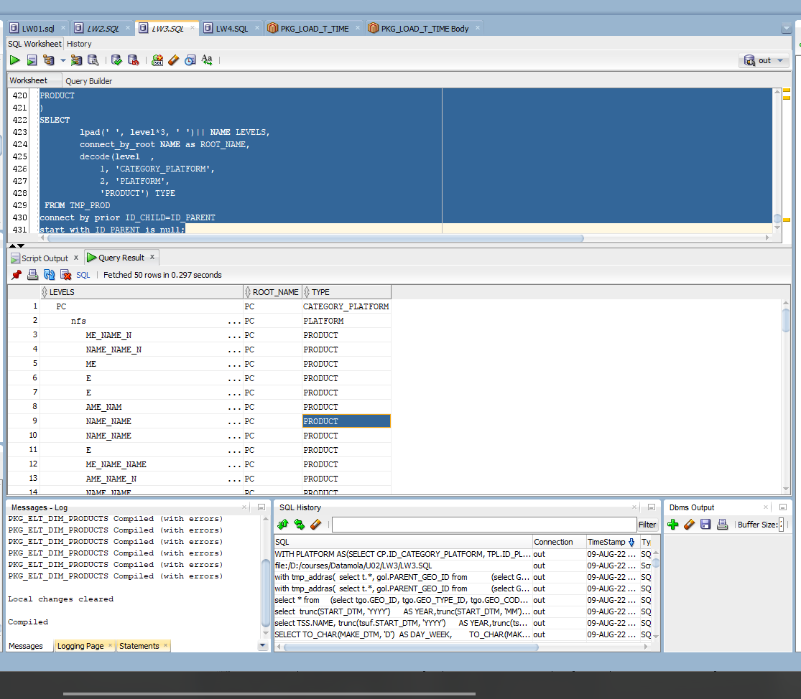

# Task 2

```sql

WITH PLATFORM AS
(
SELECT 
	CP.ID_CATEGORY_PLATFORM, 
	TPL.ID_PLATFORM,
	TPL.NAME
FROM
U_DW_PRODUCTS.T_CATEGORY_PLATFORM CP
INNER JOIN 
U_DW_PRODUCTS.T_PLATFORM TPL
ON CP.ID_CATEGORY_PLATFORM = TPL.ID_CATEGORY_PLATFORM
),
PRODUCT AS
(
SELECT 
	PLATFORM.ID_PLATFORM, 
	PLATFORM.ID_CATEGORY_PLATFORM,
	TP.ID_PROD, 
	TP.NAME 
FROM
PLATFORM
INNER JOIN
U_DW_PRODUCTS.T_PRODUCTS TP
ON TP.ID_PLATFORM =PLATFORM.ID_PLATFORM
),
TMP_PROD AS 
(
SELECT 
	TO_CHAR(ID_CATEGORY_PLATFORM) ID_CHILD,
	NULL ID_PARENT,
	NAME
FROM 
U_DW_PRODUCTS.T_CATEGORY_PLATFORM
UNION ALL
 SELECT
	ID_CATEGORY_PLATFORM||'_PL_'||ID_PLATFORM ID_CHILD,
	TO_CHAR(ID_CATEGORY_PLATFORM) ID_PARENT,
	NAME 
FROM
PLATFORM
UNION ALL
 SELECT
	ID_CATEGORY_PLATFORM||'_PL_'||ID_PLATFORM||'_P_'||ID_PROD ID_CHILD,
	ID_CATEGORY_PLATFORM||'_PL_'||ID_PLATFORM ID_PARENT,
	NAME 
FROM
PRODUCT
)
SELECT 
        lpad(' ', level*3, ' ')|| NAME LEVELS, 
        connect_by_root NAME as ROOT_NAME,
        decode(level  ,
            1, 'CATEGORY_PLATFORM',
            2, 'PLATFORM',
            'PRODUCT') TYPE
 FROM TMP_PROD
connect by prior ID_CHILD=ID_PARENT
start with ID_PARENT is null;
```

