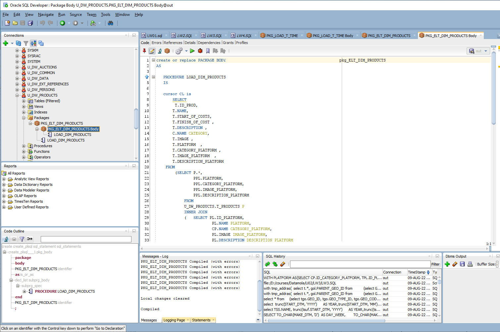
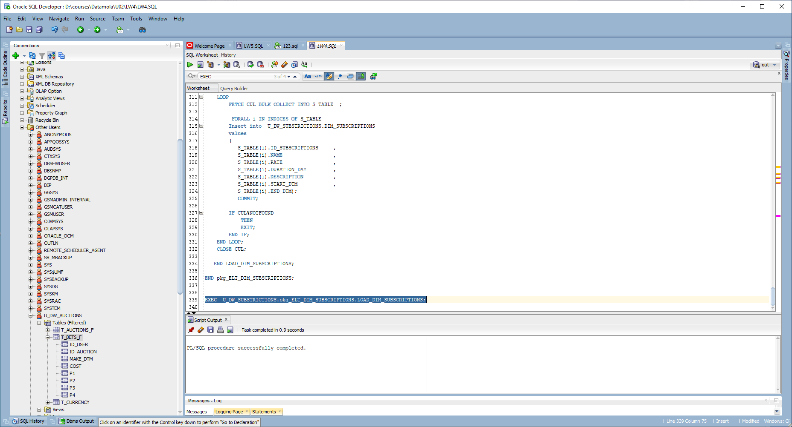

#Task 1

```sql
create or replace PACKAGE                     U_DW_PRODUCTS.pkg_ELT_DIM_PRODUCTS
AS  
   PROCEDURE LOAD_DIM_PRODUCTS;

END pkg_ELT_DIM_PRODUCTS;


create or replace PACKAGE BODY                     U_DW_PRODUCTS.pkg_ELT_DIM_PRODUCTS
AS

   PROCEDURE LOAD_DIM_PRODUCTS
   IS

   cursor CL is
       SELECT 
        T.ID_PROD,
       T.NAME,
       T.START_OF_COSTS,
       T.FINISH_OF_COST ,
       T.DESCRIPTION ,
       C.NAME CATEGORY,
       T.IMAGE ,
       T.PLATFORM  ,
       T.CATEGORY_PLATFORM ,
       T.IMAGE_PLATFORM  ,
       T.DESCRIPTION_PLATFORM 
    FROM 
        (SELECT P.*, 
                PPL.PLATFORM,
                PPL.CATEGORY_PLATFORM,
                PPL.IMAGE_PLATFORM,
                PPL.DESCRIPTION_PLATFORM
            FROM
            U_DW_PRODUCTS.T_PRODUCTS P
            INNER JOIN
            (   SELECT PL.ID_PLATFORM,
                        PL.NAME PLATFORM,
                        CP.NAME CATEGORY_PLATFORM,
                        PL.IMAGE IMAGE_PLATFORM,
                        PL.DESCRIPTION DESCRIPTION_PLATFORM
                FROM 
                    U_DW_PRODUCTS.T_PLATFORM PL
                    INNER JOIN 
                    U_DW_PRODUCTS.T_CATEGORY_PLATFORM CP
                ON
                PL.ID_CATEGORY_PLATFORM=CP.ID_CATEGORY_PLATFORM
            ) PPL
            ON 
            P.ID_PLATFORM=PPL.ID_PLATFORM
            
        ) T
        INNER JOIN 
        U_DW_PRODUCTS.T_CATEGORY C
        ON 
        T.ID_CATEGORY=C.ID_CATEGORY;
        
   TYPE ROWS_TABLE_TYPE IS TABLE OF CL%ROWTYPE; 
   R_TABLE ROWS_TABLE_TYPE;
   BEGIN
   
    EXECUTE IMMEDIATE 'TRUNCATE TABLE U_DW_PRODUCTS.DIM_PRODUCTS';
    OPEN CL;
    
    LOOP
        FETCH CL BULK COLLECT INTO R_TABLE  LIMIT 100;

         FORALL i IN INDICES OF R_TABLE
        Insert into  U_DW_PRODUCTS.DIM_PRODUCTS 
        values 
        (
        R_TABLE(i).ID_PROD,
           R_TABLE(i).NAME,
           R_TABLE(i).START_OF_COSTS,
           R_TABLE(i).FINISH_OF_COST ,
           R_TABLE(i).CATEGORY,
           R_TABLE(i).IMAGE ,
           R_TABLE(i).PLATFORM  ,
           R_TABLE(i).CATEGORY_PLATFORM ,
           R_TABLE(i).IMAGE_PLATFORM  );
        COMMIT;
		IF CL%NOTFOUND
			THEN
			EXIT;
		END IF;
    END LOOP;
    CLOSE CL;
   END LOAD_DIM_PRODUCTS;


END pkg_ELT_DIM_PRODUCTS;

```



```sql

create or replace PACKAGE                     U_DW_SUBSTRICTIONS.pkg_ELT_DIM_SUBSCRIPTIONS
AS  
   PROCEDURE LOAD_DIM_SUBSCRIPTIONS;

END pkg_ELT_DIM_SUBSCRIPTIONS;


create or replace PACKAGE BODY                     U_DW_SUBSTRICTIONS.pkg_ELT_DIM_SUBSCRIPTIONS
AS

   PROCEDURE LOAD_DIM_SUBSCRIPTIONS
   AS
   
   
     cursor CUL is
       SELECT
           TS.ID_SUBSCRIPTIONS     ,
           TSN.NAME                ,
           TS.RATE                 ,
           TS.DURATION_DAY         ,
           TS.DESCRIPTION          ,
           TS.START_DTM            ,
           TS.END_DTM              
        FROM 
        U_DW_SUBSTRICTIONS.T_SUBSCRIPTIONS TS
        INNER JOIN
        U_DW_SUBSTRICTIONS.T_SUBSCRIPTIONS_NAME TSN
        ON
        TS.ID_SUBSCRIPTIONS_NAME=TSN.ID_SUBSCRIPTIONS_NAME;
        
    TYPE ROWS_TABLE_TYPE IS TABLE OF CUL%ROWTYPE; 
    S_TABLE ROWS_TABLE_TYPE;
  
    BEGIN
   
    EXECUTE IMMEDIATE 'TRUNCATE TABLE U_DW_SUBSTRICTIONS.DIM_SUBSCRIPTIONS';
    OPEN CUL;
    
    LOOP
        FETCH CUL BULK COLLECT INTO S_TABLE  ;
        
         FORALL i IN INDICES OF S_TABLE
        Insert into  U_DW_SUBSTRICTIONS.DIM_SUBSCRIPTIONS 
        values 
        (
           S_TABLE(i).ID_SUBSCRIPTIONS     ,
           S_TABLE(i).NAME                 ,
           S_TABLE(i).RATE                 ,
           S_TABLE(i).DURATION_DAY         ,
           S_TABLE(i).DESCRIPTION          ,
           S_TABLE(i).START_DTM            ,
           S_TABLE(i).END_DTM);
           COMMIT;
        
        IF CUL%NOTFOUND
            THEN
            EXIT;
        END IF;
    END LOOP;
    CLOSE CUL;
    
   END LOAD_DIM_SUBSCRIPTIONS;

END pkg_ELT_DIM_SUBSCRIPTIONS;
```

